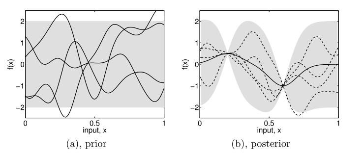
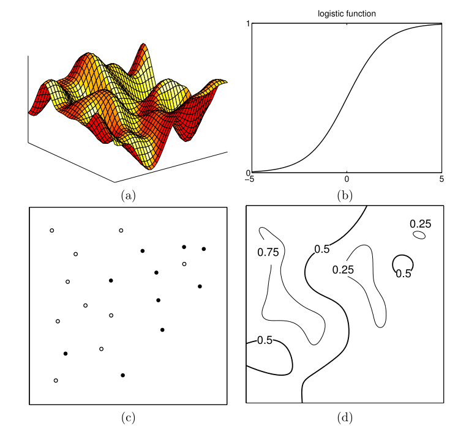

# A Pictorial Introduction to Bayesian Modelling

在这一节中我们以图形方式说明第二种(贝叶斯)方法如何处理一些简单的回归和分类示例。

我们首先考虑一个简单的`1-d`回归问题，从输入$x$到输出$f(x)$的映射。下图中，我们展示了一些从先验分布中随机抽取的样本函数，这些样本函数是由偏向于光滑函数的伪随机函数特别是高斯过程指定的。

> 图1.1

这一先验被认为代表了我们在看到任何数据之前，对我们期望观察到的函数种类的先验信息。在缺乏相反知识的情况下，我们假设样本函数在每个$x$处的平均值为零。尽管上图中特定的函数的均值并不为零，当时在任何点的$f(x)$的均值为零，与$x$无关我们一直在绘制更多的函数。在任何$x$值下，我们也可以通过计算该点的逐点方差来表征样本函数的可变性。阴影区域表示逐点标准偏差的两倍，在这种情况下，我们使用高斯过程来指定先验方差不依赖于$x$。

假设我们有一个数据集$\mathcal{D}=\{(x_1,y_1),(x_2,y_2)\}$，包括两个观测，并且我们现在希望只考虑能准确通过这两个点的函数。这种情况在上图(b)中呈现。虚线表示与$\mathcal{D}$一致的函数，实线表示这些函数的平均值。注意观测值是如何降低不确定性的。先验和观测引出了函数的后验分布。

如果添加了更多的观测值，我们将会看到平均值函数调整自己来通过这些点，并且在靠近观测值的点的后验不确定性将会减小。注意，因为高斯过程不是一个参数模型，我们不用担心模型是否可以拟合数据。尽管当很多的观测被添加进来，函数中也仍会有一些灵活性。

先验的规范很重要，因为它确定了推论所需要的函数的属性。上面我们简短地提及了函数的均值和逐点的方差。但是，也可以指定和操作其他特征。请注意，图1.1中的函数是平滑且平稳的(平稳意味着函数在所有$x$看起来都是相似的)。这些是由高斯过程的协方差函数引起的性质，许多其他协方差函数也是可能的。假设对于特殊的应用，我们认为图1.1中的函数变化太快。通过简单地调整协方差函数的参数来实现较慢的变化。高斯过程中的学习问题就是对协方差函数找到合适的特征。注意，这位我们提供了数据模型和特征(如平滑度、特征长度-尺度等)。

我们现在转到分类的问题上，并且考虑二元分类问题。这方面的一个例子是将探测到的星体分类为恒星或星系。我们的数据中恒星的标签为$+1$，星系的标签为$-1$，我们的任务是预测$\pi(x)$，即输入向量$x$是恒星的概率，使用描述每一个物体的一些特征作为输入。明显地$\pi(x)$应该位于$[0,1]$。先验函数的高斯过程不会将输出限制在此区间内，如图1.1(a)所示。我们采用的方法是通过一个响应函数逐点压缩先验函数$f$，该响应函数将输出限制在$[0,1]$内。函数的一个常见的选择是`logistic`函数：$\lambda(z)=(1+\exp(-z))^{-1}$。因此$f$的先验分布导出了概率分类$\pi$的先验。

对于二维输入空间，如图1.2所示。

> 图1.2

在(a)中，我们看到从先验函数$f$中抽取的样本，它通过`logistic`函数(b)进行压缩。数据集展示在(c)中，其中白色和黑色的点分别表示类别$+1$和$-1$。与回归的情况一样，数据的影响是在后验中降低那些与数据不兼容的函数的权重。$\pi(x)$的后验均值展示在(d)中。在本例中，我们为高斯过程选择了一个较短的特征长度尺度，以便它可以相当快的变化，在本例中注意所有的训练数据都被正确分类了。

